<div align=center>

# MQTT 协议与其开源实现 Mosquitto 分析

</div>


# MQTT 协议介绍

MQTT 协议，全称消息队列遥测传输协议（Message Queue Telemetry Transport）是一个广泛应用于物联网的轻量级传输协议。该协议基于订阅/发布的形式，旨在最小化网络带宽占用和硬件资源的消耗，适用于硬件性能或是网络连接质量不佳的情况。

## MQTT 使用的订阅/发布形式

MQTT 底层基于 TCP/IP 协议，基于订阅/发布机制。用户之间的通信基于代理（broker），并对特定话题进行订阅或是发布操作，即可进行消息传输。整个系统消息传输过程如下图所示。

<div align=center>

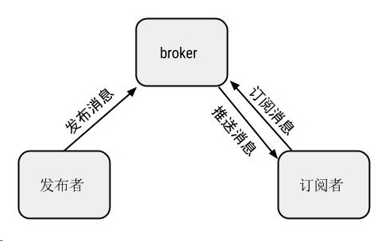

</div>

### 关于订阅/发布（subscribe / publish) 范式

维基百科中对[订阅/发布范式](https://zh.wikipedia.org/wiki/%E5%8F%91%E5%B8%83/%E8%AE%A2%E9%98%85)的定义如下：

> 在软件架构中，发布-订阅是一种消息范式，消息的发送者（称为发布者）不会将消息直接发送给特定的接收者（称为订阅者）。而是将发布的消息分为不同的类别，无需了解哪些订阅者（如果有的话）可能存在。同样的，订阅者可以表达对一个或多个类别的兴趣，只接收感兴趣的消息，无需了解哪些发布者（如果有的话）存在。

对于 MQTT 协议，运行过程中需要一个代理（broker）用于协调处理各个订阅者和发布者。下文将要分析的 Mosquitto 即是一个常用的 MQTT 代理的实现。发布者首先连接到代理，在发送消息时会指定一个话题（topic），并在该话题下发布消息，无需指定发送目标；订阅者在连接到代理后，可以通过订阅特定话题的方法获取所需的消息，无需事先获取发布者的身份信息。

在通常的物联网系统中，各种低功耗传感器在采集到环境数据后，处理单元可以基于 MQTT 协议在特定话题下发布自己采集到的传感器数据。对该数据有需求的用户可以通过订阅该话题获取该传感器数据。用于也可以通过 MQTT 协议发送控制命令以控制目标物联网设备。

连接 订阅 ping 消息 取消订阅 断开

## 术语

- 网络连接 Network Connection
MQTT使用的底层传输协议基础设施。
客户端使用它连接服务端。
它提供有序的、可靠的、双向字节流传输。

- 应用消息 Application Message 
MQTT协议通过网络传输应用数据。应用消息通过MQTT传输时，它们有关联的服务质量（QoS）和主题（Topic）。

- 客户端 Client
使用MQTT的程序或设备。客户端总是通过网络连接到服务端。它可以
发布应用消息给其它相关的客户端。
订阅以请求接受相关的应用消息。
取消订阅以移除接受应用消息的请求。
从服务端断开连接。

- 服务端 Server
一个程序或设备，作为发送消息的客户端和请求订阅的客户端之间的中介。服务端
接受来自客户端的网络连接。
接受客户端发布的应用消息。
处理客户端的订阅和取消订阅请求。
转发应用消息给符合条件的已订阅客户端。

- 订阅 Subscription
订阅包含一个主题过滤器（Topic Filter）和一个最大的服务质量（QoS）等级。订阅与单个会话（Session）关联。会话可以包含多于一个的订阅。会话的每个订阅都有一个不同的主题过滤器。

- 主题名 Topic Name
附加在应用消息上的一个标签，服务端已知且与订阅匹配。服务端发送应用消息的一个副本给每一个匹配的客户端订阅。

- 主题过滤器 Topic Filter
订阅中包含的一个表达式，用于表示相关的一个或多个主题。主题过滤器可以使用通配符。

- 会话 Session
客户端和服务端之间的状态交互。一些会话持续时长与网络连接一样，另一些可以在客户端和服务端的多个连续网络连接间扩展。

- 控制报文 MQTT Control Packet
通过网络连接发送的信息数据包。MQTT规范定义了十四种不同类型的控制报文，其中一个（PUBLISH报文）用于传输应用消息。

## MQTT 控制报文结构

MQTT协议通过交换预定义的MQTT控制报文来通信。下表展示了一个典型的 MQTT 报文的结构。

|报文结构|说明|
|-----------------|---------------------------|
| Fixed header    | 固定报头，所有控制报文都包含 |
| Variable header | 可变报头，部分控制报文包含   |
| Payload         | 有效载荷，部分控制报文包含   |

### 固定报头

每个控制报文都包含一个固定报头。固定报头格式如下。

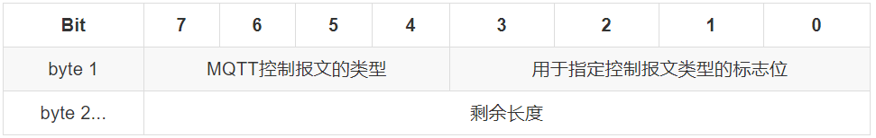

第一个字节的后四位代表报文控制类型，可选的控制类型如下。

|名字|值|报文流动方向|描述|
|----------|----|--------------|------|
|Reserved|0|禁止|保留|
|CONNECT|1|客户端到服务端|客户端请求连接服务端|
|CONNACK|2|服务端到客户端|连接报文确认|
|PUBLISH|3|两个方向都允许|发布消息|
|PUBACK|4|两个方向都允许|QoS 1消息发布收到确认|
|PUBREC|5|两个方向都允许|发布收到（保证交付第一步）|
|PUBREL|6|两个方向都允许|发布释放（保证交付第二步）
|PUBCOMP|7|两个方向都允许|QoS 2消息发布完成（保证交互第三步）|
|SUBSCRIBE|8|客户端到服务端|客户端订阅请求|
|SUBACK|9|服务端到客户端|订阅请求报文确认|
|UNSUBSCRIBE|10|客户端到服务端|客户端取消订阅请求|
|UNSUBACK|11|服务端到客户端|取消订阅报文确认|
|PINGREQ|12|客户端到服务端|心跳请求|
|PINGRESP|13|服务端到客户端|心跳响应|
|DISCONNECT|14|客户端到服务端|客户端断开连接|
|Reserved|15|禁止|保留|

第一个字节的前四位包含每个MQTT控制报文类型特定的标志。

固定报头从第二个字节开始定义为剩余长度，表示当前报文剩余部分的字节数，包括可变报头和负载的数据。剩余长度不包括用于编码剩余长度字段本身的字节数。

剩余长度字段使用一个变长度编码方案，对小于128的值它使用单字节编码。更大的值按下面的方式处理：

- 低7位有效位用于编码数据，最高有效位用于指示是否有更多的字节，且按照大端方式进行编码。

因此每个字节可以编码128个数值和一个延续位（continuation bit）。剩余长度字段最大4个字节。

### 可变报头

某些MQTT控制报文包含一个可变报头部分。它在固定报头和负载之间。可变报头的内容随报文类型变化。可变报头的报文标识符（Packet Identifier）字段存在于在多个类型的报文里。

很多控制报文的可变报头部分包含一个两字节的报文标识符字段。包含标识符的控制报文类型如下： 
PUBLISH（QoS > 0时）， PUBACK，PUBREC，PUBREL，PUBCOMP，SUBSCRIBE, SUBACK，UNSUBSCRIBE，UNSUBACK。

对于 SUBSCRIBE， UNSUBSCRIBE 以及 QoS > 0 时的 PUBLISH 报文，该类报文必须包含一个非零长度为两字节的报文标识符。客户端每次发送一个新的这些类型的报文时都必须分配一个当前未使用的报文标识符。如果一个客户端要重发这个特殊的控制报文，在随后重发那个报文时，它必须使用相同的标识符。当客户端处理完这个报文对应的确认后，这个报文标识符就释放可重用。 QoS=1 的 PUBLISH 对应 PUBACK， QoS=2 的 PUBLISH 对应 PUBCOMP，SUBSCRIBE 对应 SUBACK， UNSUBSCIRBE 对应 UNSUBACK。此时 PUBACK,  PUBREC, PUBREL 报文必须包含与最初发送的 PUBLISH 报文相同的报文标识符。类似地，SUBACK 和 UNSUBACK 必须包含对应的 SUBSCRIBE 和 UNSUBSCRIBE 报文中使用的报文标识符 [MQTT-2.3.1-7]。发送一个 QoS=0 的PUBLISH 报文时，相同的条件也适用于服务端。

另外，QoS=0的PUBLISH报文不能包含报文标识符。

### 有效载荷

某些MQTT控制报文在报文的最后部分包含一个有效载荷。对于PUBLISH来说有效载荷就是应用消息。下表列出了需要有效载荷的控制报文。

|控制报文|有效载荷|
|--------|------|
|CONNECT|需要|
|CONNACK|不需要|
|PUBLISH|可选|
|PUBACK|不需要|
|PUBREC|不需要|
|PUBREL|不需要|
|PUBCOMP|不需要|
|SUBSCRIBE|需要|
|SUBACK|需要|
|UNSUBSCRIBE|需要|
|UNSUBACK|不需要|
|PINGREQ|不需要|
|PINGRESP|不需要|
|DISCONNECT|不需要|

## MQTT 控制报文

### CONNECT - 连接客户端

客户端到服务端的网络连接建立后，客户端发送给服务端的第一个报文必须是CONNECT报文。在一个网络连接上，客户端只能发送一次CONNECT报文。服务端必须将客户端发送的第二个CONNECT报文当作协议违规处理并断开客户端的连接。有效载荷包含一个或多个编码的字段。包括客户端的唯一标识符，遗嘱（Will）主题，遗嘱（Will）消息，用户名和密码。除了客户端标识之外，其它的字段都是可选的，基于标志位来决定可变报头中是否需要包含这些字段。

**固定报头**

CONNECT 报文的固定报头如下图所示。其中剩余长度等于可变报头的长度（10字节）加上有效载荷的长度。

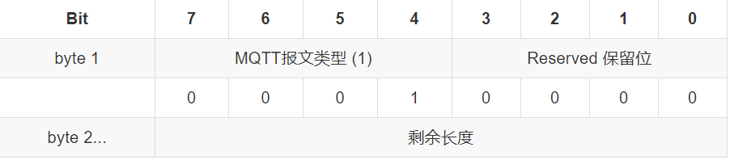


**可变报头**

CONNECT报文的可变报头按下列次序包含四个字段：协议名（Protocol Name），协议级别（Protocol Level），连接标志（Connect Flags）和保持连接（Keep Alive）。

协议名是表示协议名 MQTT 的UTF-8编码的字符串。MQTT规范的后续版本不会改变这个字符串的偏移和长度。数据包检测工具，例如防火墙，可以使用协议名来识别MQTT流量。

客户端用8位的无符号值表示协议的修订版本。对于3.1.1版协议，协议级别字段的值是4(0x04)。如果发现不支持的协议级别，服务端必须给发送一个返回码为0x01（不支持的协议级别）的CONNACK报文响应CONNECT报文，然后断开客户端的连接。

连接标志字节包含一些用于指定MQTT连接行为的参数。它还指出有效载荷中的字段是否存在。该字节各位的意义如下图所示。服务端必须验证CONNECT控制报文的保留标志位（第0位）是否为0，如果不为0必须断开客户端连接。

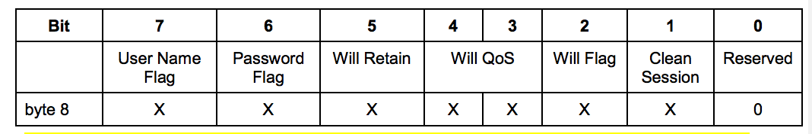

- MQTT 的遗嘱（Will）机制

遗嘱标志（Will Flag）被设置为1，表示如果连接请求被接受了，遗嘱（Will Message）消息必须被存储在服务端并且与这个网络连接关联。之后网络连接关闭时，服务端必须发布这个遗嘱消息，除非服务端收到DISCONNECT报文时删除了这个遗嘱消息。

遗嘱消息发布的条件，包括但不限于：
服务端检测到了一个I/O错误或者网络故障。
客户端在保持连接（Keep Alive）的时间内未能通讯。
客户端没有先发送DISCONNECT报文直接关闭了网络连接。
由于协议错误服务端关闭了网络连接。

如果遗嘱标志被设置为1，连接标志中的Will QoS和Will Retain字段会被服务端用到，同时有效载荷中必须包含Will Topic和Will Message字段。

一旦被发布或者服务端收到了客户端发送的DISCONNECT报文，遗嘱消息就必须从存储的会话状态中移除。如果遗嘱标志被设置为0，连接标志中的Will QoS和Will Retain字段必须设置为0，并且有效载荷中不能包含Will Topic和Will Message字段。如果遗嘱标志被设置为0，网络连接断开时，不能发送遗嘱消息。

服务端应该迅速发布遗嘱消息。在关机或故障的情况下，服务端可以推迟遗嘱消息的发布直到之后的重启。如果发生了这种情况，在服务器故障和遗嘱消息被发布之间可能会有一个延迟。

遗嘱QoS （Will QoS）
在连接标志的第4和第3位。这两位用于指定发布遗嘱消息时使用的服务质量等级。如果遗嘱标志被设置为0，遗嘱QoS也必须设置为0(0x00)。如果遗嘱标志被设置为1，遗嘱QoS的值可以等于0(0x00)，1(0x01)，2(0x02)。它的值不能等于3。

遗嘱保留 （Will Retain）
在连接标志的第5位。如果遗嘱消息被发布时需要保留，需要指定这一位的值。如果遗嘱标志被设置为0，遗嘱保留（Will Retain）标志也必须设置为0。如果遗嘱标志被设置为1：如果遗嘱保留被设置为0，服务端必须将遗嘱消息当作非保留消息发布。如果遗嘱保留被设置为1，服务端必须将遗嘱消息当作保留消息发布。

**有效载荷**

CONNECT报文的有效载荷（payload）包含一个或多个以长度为前缀的字段，可变报头中的标志决定是否包含这些字段。如果包含的话，必须按这个顺序出现：客户端标识符，遗嘱主题，遗嘱消息，用户名，密码。服务端使用客户端标识符 (ClientId) 识别客户端。客户端标识符 (ClientId) 必须存在而且必须是CONNECT报文有效载荷的第一个字段，且必须是UTF-8编码字符串。在对应的标志位设置为1时，有效载荷按上述顺序组织消息。

### CONNACK – 确认连接请求

服务端发送CONNACK报文响应从客户端收到的CONNECT报文。服务端发送给客户端的第一个报文必须是CONNACK。如果客户端在合理的时间内没有收到服务端的CONNACK报文，客户端应该关闭网络连接。合理 的时间取决于应用的类型和通信基础设施。

**固定报头**

CONNACK 包的固定报头如下图所示。其中可变报头的长度为2。

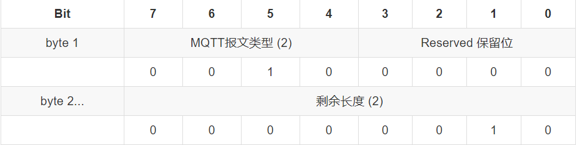

**可变报头**
可变报头第1个字节是 连接确认标志，位7-1是保留位且必须设置为0。 第0 (SP)位 是当前会话（Session Present）标志。

如果服务端收到清理会话（CleanSession）标志为1的连接，除了将 CONNACK 报文中的返回码设置为0之外，还必须将 CONNACK 报文中的当前会话（Session Present）标志设置为0 。

可变报头的第2个字节是连接返回码。连接返回码字段使用一个字节的无符号值。如果服务端收到一个合法的CONNECT报文，但出于某些原因无法处理它，服务端应该尝试发送一个包含非零返回码（表格中的某一个）的CONNACK报文。如果服务端发送了一个包含非零返回码的CONNACK报文，那么它必须关闭网络连接。

|值|返回码响应|描述|
|--|---------|---|
|0|0x00连接已接受|连接已被服务端接受|
|1|0x01连接已拒绝，不支持的协议版本|服务端不支持客户端请求的MQTT协议级别|
|2|0x02连接已拒绝，不合格的客户端标识符|客户端标识符是正确的UTF-8编码，但服务端不允许使用|
|3|0x03连接已拒绝，服务端不可用|网络连接已建立，但MQTT服务不可用|
|4|0x04连接已拒绝，无效的用户名或密码|用户名或密码的数据格式无效|
|5|0x05连接已拒绝，未授权|客户端未被授权连接到此服务器|
|6-255||保留|

如果认为上表中的所有连接返回码都不太合适，那么服务端必须关闭网络连接，不需要发送CONNACK报文。

**有效载荷**

该类报文无有效载荷。

### PUBLISH – 发布消息

PUBLISH控制报文是指从客户端向服务端或者服务端向客户端传输一个应用消息。

**固定报头**

PUBLISH 报文的固定报头如下图所示包含重发标志（DUP），服务质量等级（QoS）和保留标志（RETAIN）。

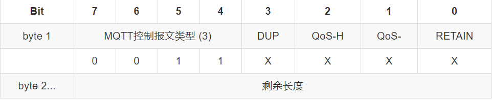

**可变报头**

可变报头按顺序包含主题名和报文标识符。主题名（Topic Name）用于识别有效载荷数据应该被发布到哪一个信息通道。对于报文标识符字段，只有当QoS等级是1或2时，其才能出现在 PUBLISH 报文中。

**有效载荷**

有效载荷包含将被发布的应用消息。数据的内容和格式是应用特定的。有效载荷的长度这样计算：用固定报头中的剩余长度字段的值减去可变报头的长度。包含零长度有效载荷的PUBLISH报文是合法的。

PUBLISH 报文的接收者必须按照根据 PUBLISH 报文中的 QoS 等级发送响应，根据 QoS 的不同响应如下图所示。

|服务质量等级|	预期响应|
|------|------|
|QoS 0|	无响应|
|QoS 1|	PUBACK报文|
|QoS 2|	PUBREC报文|

### PUBACK PUBREC PUBREL PUBCOMP - 发布确认/收到/释放/完成 

在 QoS 为 1 时，响应为 PUBACK 报文。在 QoS 为 2 时，响应为收到/释放/完成报文。

**固定报头**

PUBACK 固定报头如下所示。对于该类报文，PUBACK 的可变报文长度值为2。

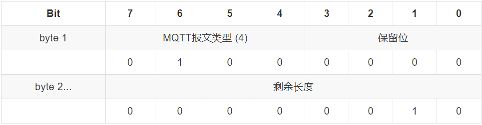

PUBREC/PUBREL/PUBCOMP 三类报文和 PUBACK 类似，其报文类型参照之前的定义。

**可变报头**

这几类报文的可变报头部分均包含等待确认的PUBLISH报文的报文标识符。

**有效载荷**

该类报文没有有效载荷。

### SUBSCRIBE 订阅主题

客户端向服务端发送 SUBSCRIBE 报文用于创建一个或多个订阅。每个订阅注册客户端关心的一个或多个主题。为了将应用消息转发给与那些订阅匹配的主题，服务端发送 PUBLISH 报文给客户端。 SUBSCRIBE 报文也（为每个订阅）指定了最大的 QoS 等级，服务端根据这个发送应用消息给客户端。

**固定报头**

SUBSCRIBE 报文如下所示。SUBSCRIBE控制报固定报头的前四位是保留位，必须分别设置为0,1,0,0。其它的任何值都当做是不合法的，服务端必须关闭其网络连接。

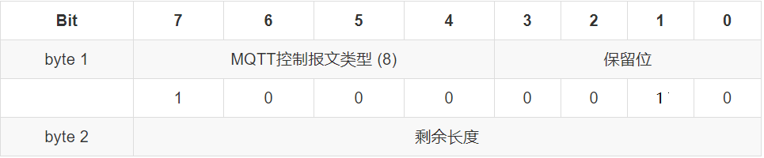

**可变报头**

可变报头包含报文标识符。其格式遵循通用的报文标识符格式。

**有效载荷**

SUBSCRIBE 报文的有效载荷如下图所示。

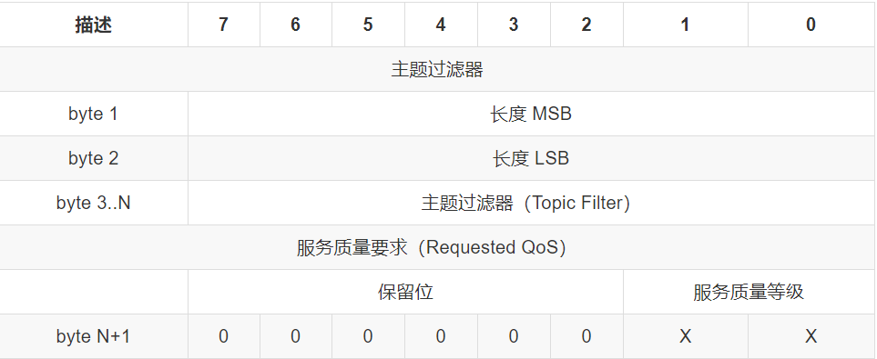

SUBSCRIBE报文的有效载荷包含了一个主题过滤器列表，它们表示客户端想要订阅的主题。SUBSCRIBE报文有效载荷中的主题过滤器列表必须是特定格式的UTF-8字符串。服务端应该支持包含通配符的主题过滤器。如果服务端选择不支持包含通配符的主题过滤器，必须拒绝任何包含通配符过滤器的订阅请求。每一个过滤器后面跟着一个字节，这个字节被叫做服务质量要求（Requested QoS）。它给出了服务端向客户端发送应用消息所允许的最大QoS等级。SUBSCRIBE报文的有效载荷必须包含至少一对主题过滤器 和 QoS等级字段组合。没有有效载荷的SUBSCRIBE报文是违反协议的。
另外，当前版本的协议没有用到服务质量要求（Requested QoS）字节的高六位。如果有效载荷中的任何位是非零值，或者QoS不等于0,1或2，服务端必须认为SUBSCRIBE报文是不合法的，并关闭网络连接。

### SUBACK - 订阅确认

SUBACK报文由服务端发送给客户端，用于确认它已收到并且正在处理SUBSCRIBE报文。SUBACK报文包含一个返回码清单，它们指定了SUBSCRIBE请求的每个订阅被授予的最大QoS等级。

**固定报头**

SUBACK 的固定报头如下图所示。其中的剩余长度字段等于可变报头的长度加上有效载荷的长度。

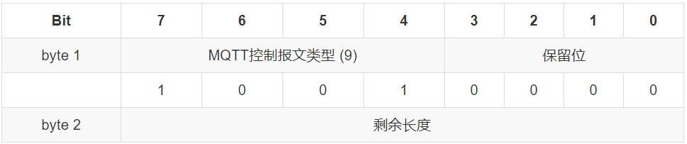

**可变报头**

包含等待确认的SUBSCRIBE报文的报文标识符，其格式遵循通用的可变报头格式。

**有效载荷**

有效载荷包含一个返回码清单。每个返回码对应等待确认的SUBSCRIBE报文中的一个主题过滤器。返回码的顺序必须和SUBSCRIBE报文中主题过滤器的顺序相同。

每个返回码长度为一个字节，允许的返回码有以下几种，除此之外不能使用：
- 0x00 - 最大QoS 0
- 0x01 - 成功 – 最大QoS 1
- 0x02 - 成功 – 最大 QoS 2
- 0x80 - Failure 失败

### UNSUBSCRIBE - 取消订阅

客户端发送UNSUBSCRIBE报文给服务端，用于取消订阅主题。

**固定报头**

UNSUBSCRIBE报文固定报头如下图所示，其第3,2,1,0位是保留位且必须分别设置为0,0,1,0。服务端必须认为任何其它的值都是不合法的并关闭网络连接。其剩余长度字段等于可变报头的长度加上有效载荷的长度。

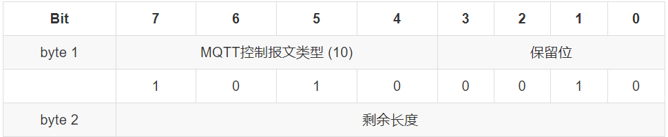

**可变报头**

可变报头包含报文标识符。其格式遵循通用的报文标识符格式。

**有效载荷**

UNSUBSCRIBE 报文的有效载荷包含客户端想要取消订阅的主题过滤器列表。必须是连续打包的，且必须至少包含一个消息过滤器。没有有效载荷的UNSUBSCRIBE报文是违反协议的。

### UNSUBACK - 取消订阅确认

服务端发送UNSUBACK报文给客户端用于确认收到UNSUBSCRIBE报文。

**固定报头**

UNSUBACK 的固定报头如下图所示。其中的剩余长度字段等于可变报头的长度加上有效载荷的长度，即为2。

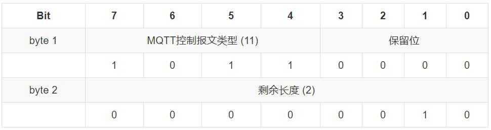

**可变报头**

包含等待确认的UNSUBSCRIBE报文的报文标识符，其格式遵循通用的可变报头格式。

**有效载荷**

该类报文无有效载荷。

### PINGREQ & PINGRESP - 心跳请求和心跳响应

客户端发送 PINGREQ 报文给服务端。用途如下：
- 在没有任何其它控制报文从客户端发给服务的时，告知服务端客户端还活着。
- 请求服务端发送 响应确认它还活着。
- 使用网络以确认网络连接没有断开。

服务端发送PINGRESP报文响应客户端的PINGREQ报文。表示服务端还活着。

保持连接（Keep Alive）处理中用到两个报文。

**固定报头**

PINGREQ 报文的固定报头如下所示：

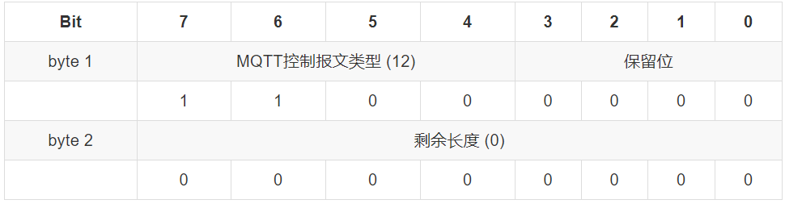

PINGRESP 报文的固定报头如下所示：


**可变报头和有效载荷**

这两类报文均无可变报头和有效载荷。

### DISCONNECT - 断开连接

DISCONNECT报文是客户端发给服务端的最后一个控制报文。表示客户端正常断开连接。

**固定报头**

DISCONNECT 报文固定报头如下所示： 

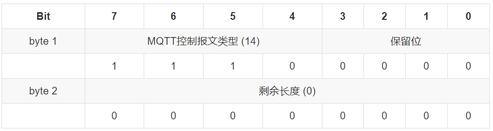

**可变报头和有效载荷**

该类报文无可变报头和有效载荷。

客户端发送DISCONNECT报文之后：
- 必须关闭网络连接；
- 不能通过那个网络连接再发送任何控制报文。

服务端在收到DISCONNECT报文时：
- 必须丢弃任何与当前连接关联的未发布的遗嘱消息；
- 未关闭网络连接的情况下，应该关闭网络连接。


## 操作行为

### 状态存储

为了提供服务质量保证，客户端和服务端有必要存储会话状态。在整个会话期间，客户端和服务端都必须存储会话状态。会话必须至少持续和它的活跃网络连接同样长的时间。服务端的保留消息不是会话状态的组成部分。服务端应该保留消息直到客户端删除它。

### 网络连接

MQTT协议要求基础传输层能够提供有序的、可靠的、双向传输的字节流。目前 MQTT 协议使用 TCP/IP 传输层协议。并支持 TLS 和 Websocket。

### 服务质量等级（QoS）

MQTT按照下列定义的服务质量 (QoS) 等级分发应用消息。MQTT 的服务质量等级分为三个，即 0 - 最多分发一次， 1 - 最少分发一次， 2 - 仅分发一次。

#### QoS 0:最多分发一次

消息的分发依赖于底层网络的能力。接收者不会发送响应，发送者也不会重试。消息可能送达一次也可能根本没送达。对于QoS 0的分发协议，发送者必须发送 QoS 等于0，DUP 等于0的 PUBLISH 报文。接收者接受 PUBLISH 报文时同时接受消息的所有权。

#### QoS 1: 至少分发一次

服务质量确保消息至少送达一次。QoS 1的PUBLISH报文的可变报头中包含一个报文标识符，需要PUBACK报文确认。

对于QoS 1的分发协议的发送方，有如下约定：

- 发送者每次发送新的应用消息都必须分配一个未使用的报文标识符。
- 发送的PUBLISH报文必须包含报文标识符且QoS等于1，DUP等于0。
- 在从接收者那收到对应的PUBACK报文之前，必须将这个PUBLISH报文看作是未确认的。

对于接收方有如下约定：
- 响应的PUBACK报文必须包含一个报文标识符，这个标识符来自接收到的、已经接受所有权的PUBLISH报文。
- 发送了PUBACK报文之后，接收者必须将任何包含相同报文标识符的入站PUBLISH报文当作一个新的消息，并忽略它的DUP标志的值。

#### QoS 2：仅分发一次

这是最高等级的服务质量，消息丢失和重复都是不可接受的。使用这个服务质量等级会有额外的开销。

QoS 2的消息可变报头中有报文标识符。2.3.1节提供了有关报文标识符的更多信息。QoS 2的PUBLISH报文的接收者使用一个两步确认过程来确认收到。

对于QoS 2的分发协议的发送者有如下约定：

- 必须给要发送的新应用消息分配一个未使用的报文标识符。
- 发送的PUBLISH报文必须包含报文标识符且报文的QoS等于2,，DUP等于0。
- 必须将这个PUBLISH报文看作是 未确认的 ，直到从接收者那收到对应的PUBREC报文。4.4节有一个关于未确认消息的讨论。
- 收到PUBREC报文后必须发送一个PUBREL报文。PUBREL报文必须包含与原始PUBLISH报文相同的报文标识符。
- 必须将这个PUBREL报文看作是 未确认的 ，直到从接收者那收到对应的PUBCOMP报文。
- 一旦发送了对应的PUBREL报文就不能重发这个PUBLISH报文。

对于QoS 2的分发协议的接收者有如下约定：
- 响应的PUBREC报文必须包含报文标识符，这个标识符来自接收到的、已经接受所有权的PUBLISH报文。
- 在收到对应的PUBREL报文之前，接收者必须发送PUBREC报文确认任何后续的具有相同标识符的PUBLISH报文。 在这种情况下，它不能重复分发消息给任何后续的接收者。
- 响应PUBREL报文的PUBCOMP报文必须包含与PUBREL报文相同的标识符。
- 发送PUBCOMP报文之后，接收者必须将包含相同报文标识符的任何后续PUBLISH报文当作一个新的发布。

### 消息分发重试

客户端设置清理会话（CleanSession）标志为0重连时，客户端和服务端必须使用原始的报文标识符重发任何未确认的PUBLISH报文（如果QoS>0）和PUBREL报文。这是唯一要求客户端或服务端重发消息的情况。

### 消息收到

服务端接管入站应用消息的所有权时，它必须将消息添加到订阅匹配的客户端的会话状态中。正常情况下，客户端收到发送给它的订阅的消息。客户端也可能收到不是与它的订阅精确匹配的消息。如果服务端自动给客户端分配了一个订阅，可能发生这种情况。正在处理UBSUBSCRIBE请求时也可能收到消息。客户端必须按照可用的服务质量（QoS）规则确认它收到的任何PUBLISH报文，不管它选择是否处理报文包含的应用消息。

### 消息排序

为实现消息排序，客户端必须遵循下列规则：
- 重发任何之前的PUBLISH报文时，必须按原始PUBLISH报文的发送顺序重发（适用于QoS 1和QoS 2消息）

- 必须按照对应的PUBLISH报文的顺序发送PUBACK（QoS 1）/PUBREC（QoS 2）/PUBREL（QoS 2）报文。

服务端必须默认认为每个主题都是有序的。它可以提供一个管理功能或其它机制，以允许将一个或多个主题当作是无序的。服务端处理发送给有序主题的消息时，必须按照上面的规则将消息分发给每个订阅者。此外，它必须按照从客户端收到的顺序发送PUBLISH报文给消费者（对相同的主题和QoS）。


# MQTT broker 开源实现 Eclipse Mosquitto

[Eclipse Mosquitto](https://mosquitto.org/)是一个开源的 MQTT broker ，目前支持 MQTT v3.1 和 v3.1.1 协议， 同时提供了一个 C 语言动态链接库 `libmosquitto` ，用于实现 MQTT 客户端。项目本身也使用该库实现了一个简单的 MQTT 协议命令行客户端 `mosquitto_sub` 和 `mosquitto_pub` 用于发布和订阅消息。

## 初始化和清除

包含下列两个方法。
```C
int mosquitto_lib_init();    
int mosquitto_lib_cleanup();     
```
客户端程序使用 `libmosquitto` 库函数前，要先调用 `mosquitto_lib_init()` 初始化；程序使用 `libmosquitto` 库后，要调用 `mosquitto_lib_cleanup()` 进行清理。

## 构建和释放客户端

客户端可以使用下述方法新建一个 mosquitto 客户端实例。

```C
struct mosquitto *mosquitto_new(const char *id, bool clean_session, void *userdata);
```

各参数的类型与意义：

- `const char* id` : client ID。如果设为 NULL ，会自动生成一个随机 ID 。
- `bool clean_session` : 如果设为 false ，当 client 断开连接后，broker 会保留该 client 的订阅和消息，直到再次连接成功；如果设为 true ，client 断开连接后，broker 会将所有的订阅和消息删除。
- `void* userdata` : 传递给回调函数的用户数据。

调用成功时，返回一个 `struct mosquitto` 指针，失败时返回 `NULL` 指针，并产生错误代码。可以用 `mosquitto_strerror()` 函数获取错误代码的含义。

## 连接

连接使用的方法声明如下：

```C
libmosq_EXPORT int mosquitto_connect(struct mosquitto *mosq,
                                    const char*	host,
                                    int port,
                                    int keepalive)
```

各参数定义如下：

- `struct mosquitto *mosq` : client 实例；
- `const char* host` :  broker 的 IP 或者 hostname；
- `int port` : 连接用端口，默认为`1883`（无TLS）或`8883`（有TLS）；
- `int keepalive` : 保持连接的时间间隔，单位是秒。

连接成功会返回 MOSQ_ERR_SUCCESS 。

该函数还有一些扩展，比如可以绑定本地网络接口的 `mosquitto_connect_bind` 。如果调用了这两个函数连接 broker ，就必须使用 `mosquitto_loop()` 或者 `mosquitto_loop_forever()` 启动网络循环。还有一些非阻塞的连接函数，例如 `mosquitto_connect_async()`，调用它们的时候，必须使用 `mosquitto_loop_start()` 启动网络循环。断开连接可以调用 `int mosquitto_disconnect(struct mosquitto *mosq)` ，此外还有重连函数 `mosquitto_reconnect()`。

## 订阅

使用下述方法进行订阅操作：
```C
libmosq_EXPORT int mosquitto_subscribe(struct mosquitto *mosq,
                                        int *mid,
                                        const char *sub,
                                        int qos);
```

各参数定义如下：
- `struct mosquitto *mosq` : client 实例；
- `int *mid` : 如果不为 NULL，函数会把它作为该话题消息的ID ，用于订阅回调函数；
- `const char *sub` : 话题名称；
- `int qos` : 服务质量，与先前的定义相同。

调用成功会返回 MOSQ_ERR_SUCCESS ，但这不代表订阅成功。

取消订阅时使用下述函数，各参数方法与订阅用函数相同。
```C
int mosquitto_unsubscribe( struct mosquitto *mosq,
                            int *mid,
                            const char *sub,
                        );
```

## 发布

客户端发布操作需要调用下述函数，其声明如下：
```C
int mosquitto_publish(  struct mosquitto *mosq,
                        int *mid,
                        const char *topic,
                        int payloadlen,
                        const void *payload,
                        int qos,
                        bool retain 
                     );
```

各参数定义如下：
- `struct mosquitto *mosq` : client 实例；
- `int *mid` : 消息的 ID, 不能为 NULL；
- `int payloadlen` : 消息的长度；
- `const void *playload` : 消息的内容； 
- `int qos` : 服务质量；
- `bool retain` : 是否保留信息。

## 网络循环

包括两个函数，即 `mosquitto_loop()` 和 `mosquitto_loop_forever()`。

```C
int mosquitto_loop(struct mosquitto *mosq, // client 实例
                    int timeout,           // 阻塞等待时间，单位为微秒
                    int max_packets        // 未使用值，设为 1
                    );
```

客户端主网络循环，必须调用该函数来保持 client 和 broker 之间的通讯。收到或者发送消息时，它会调用相应的回调函数处理。当 QoS>0 时，它还会尝试重发消息。

如果程序里只会运行一个 MQTT client 的循环，可以调用 `mosquitto_loop_forever()` ,其声明如下，参数意义与 `mosquitto_loop()` 函数相同。它会在一个阻塞的无限循环里调用 `mosquitto_loop()` ，如果从服务器掉线了，它会自动重连。直到在某个回调函数中调用了 `mosquito_disconnect()` ，该函数才会返回。

```C
int mosquitto_loop_forever(struct mosquitto *mosq, // client 实例
                    int timeout,           // 阻塞等待时间，单位为微秒
                    int max_packets        // 未使用值，设为 1
                    );
```

## 回调函数

设置不同的回调函数，`mosquitt_loop()` 会根据不同的情况，调用相应的回调函数。

#### 确认连接回调函数

函数声明如下：

```C
void mosquitto_connect_callback_set(struct mosquitto *mosq, // client 实例
                                    void (*on_connect)
                                        (struct mosquitto *mosq, // client 实例
                                         void *obj, // mosquitto_new() 函数提供的用户数据
                                         int rc)    // broker 回应的代码
                                    );
```

当客户端请求连接后，broker 会回应一条 CONNACK 消息（确认连接请求），客户端收到后会调用回调函数。在这个回调函数里客户端判断连接是否成功，成功后再调用 `mosquitto_subscribe()` 订阅话题，可以依次订阅多个话题。

#### 断开连接回调函数
函数声明如下：
```C
void mosquitto_disconnect_callback_set(struct mosquitto *mosq,
        void (*on_disconnect)(struct mosquitto *mosq, void *obj, int rc)
        );
```

当客户端与 broker 断开连接后，会调用该回调函数。回调函数中的 rc 表示断开连接的原因，0 表示 client 调用了 mosquitt_disconnect() ，其他值都表示未知原因。

#### 消息回调函数
函数声明如下：
```C
void mosquitto_message_callback_set( struct mosquitto *mosq,
    void (*on_message)(struct mosquitto *mosq, void *obj, const struct mosquitto_message *message)
);
```

参数`const struct mosquitto_message *message` 保存了收到的消息，回调函数退出后这个指针指向的内存就会被释放，它的定义如下：

```C
struct mosquitto_message{
    int mid;
    char *topic;  //消息话题
    void *payload;  //消息内容，MQTT 中叫做有效载荷
    int payloadlen;  //消息的长度，单位是字节
    int qos;  //服务质量
    bool retain;  //是否保留消息
};
```

#### 订阅回调函数
函数声明如下：
```C
void mosquitto_subscribe_callback_set(struct mosquitto *mosq,
        void (*on_subscribe)(struct mosquitto *mosq, void *obj, 
                int mid,    //消息 ID
                int qos_count, // granted_qos 数组大小
                const int *granted_qos
                ) // 已经批准的订阅的 QoS，是一个数组指针
        );
```

broker 收到订阅请求后，会向 client 发送一个 SUBACK 报文作为回应，client 收到后就会调用这里设置的函数，可以在回调函数里判断订阅是否成功。

#### 取消订阅回调函数
函数声明如下：
```C
void mosquitto_unsubscribe_callback_set(struct mosquitto *mosq,
        void (*on_unsubscribe)(struct mosquitto *mosq, void *obj, int mid)
        );
```

broker 收到取消订阅的请求后，会向客户端发送一个 UNSUBACK 报文作为回应，客户端收到后就会调用这里设置的函数。

#### 日志回调函数
函数声明如下：
```C
void mosquitto_log_callback_set(struct mosquitto *mosq,
        void (*on_log)(struct mosquitto *mosq, void *obj, 
        int level,      // 日志等级
        const char *str // 日志内容
        )
        );
```

当 `libmosquitto` 产生日志信息时会调用这里设置的函数。可以在回调函数中打印这些日志。