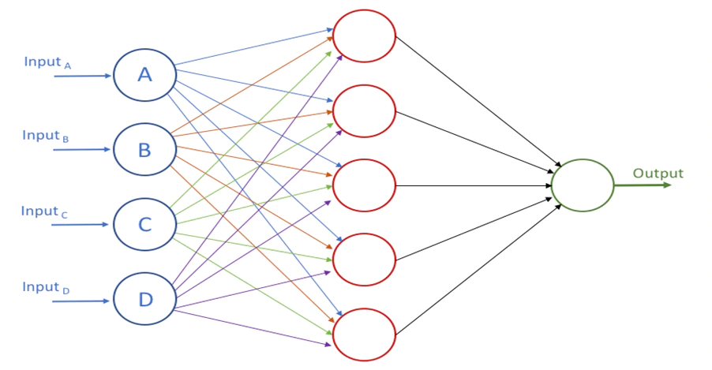

## 神经网络与深度学习

### 使用神经网络识别手写数字

#### 关于感知机（Perceptron）

- 在 20 世纪五、六⼗年代由科学家 Frank Rosenblatt 发明，其受到 Warren McCulloch 和 Walter Pitts 早期著作的影响。

- 一个感知机接受几个二进制输入，并产生一个二进制输出。

- 感知机为每个输入分配一个**权重**，感知机计算每个输入的加权和后与一个设定的**阈值**参数对比，确定输出。超过阈值时输出一个值，未超过时输出另一个值。

- 使用简化的感知机数学描述。 记 $w_j$ 表示权重， $x_j$ 表示输入， $\sum_jw_jx_j$ 表示加权和，并简记为 $w \cdot x$。表示时把阈值移动到判断的不等式的一边，并记为感知机的**偏置**，用$b \equiv -threshold$ 表示。这样，感知机的规则可以写成：

$$ output=
\begin{cases}
    0 & if & w \cdot x+b \leq 0  \\
    1 & if & c \cdot x + b  \geq 0 \\
\end{cases} $$ 

- 我们可以⽤感知机来计算简单的逻辑功能。实际上，我们完全能⽤感
知器⽹络来计算任何逻辑功能。

#### 关于 S 型神经元

- S 型神经元有多个输入 $x_1$, $x_2$, $x_3$, etc. 但是这些神经元的输入不仅是 $0$ 或 $1$ ， 也有可能是除此之外的其他输入。

- 与感知机相同， S 型神经元也有针对每个输入的权重 $w_1$ $w_2$ $w_3$ etc. 其也有一个总的偏置 $b_0$。

- S 型神经元的输出并非是 0 或 1。相反，它现在被称为 S 型函数（Sigmoid 函数）。记为 $\sigma(w \cdot x+ b)$. 其定义为：

$$ \sigma(z) \equiv \frac{1}{1+e^{-z}} $$

也就是说，使用现有的符号表示一个 S 型神经元的输出，可以表示为：

$$ output = \frac{1}{1+ exp(- \sum_j w_jx_j-b)} $$

- 当 $w\cdot x + b$ 趋近于正无穷大或是趋近于负无穷大的时候， S 型神经元的输出接近于 1 和 0，和感知机相似。只有当 $w\cdot x + b$ 取中间值时，才有较大的偏离。

#### 神经网络的架构

一个典型的神经网络架构如下图所示。[（图片来源）](https://www.google.com/url?sa=i&source=images&cd=&ved=2ahUKEwiQ9Nqr4ZvlAhULiHAKHcUgAgQQjhx6BAgBEAI&url=https%3A%2F%2Fdeveloper.oracle.com%2Fdatabases%2Fneural-network-machine-learning.html&psig=AOvVaw0dz5unA3lsnbfzkIrqKLfw&ust=1571142798595106)

- 最左边称为**输入层**，其神经元叫做**输入神经元**。最右边即为**输出层**和**输出神经元**。中间的一层被称为**隐藏层**，代表“既非输入也非输出”。

- 有的地方将这种多层网络称为多层感知机或是 MLP，尽管其是由 S 型神经元构成。

- ⽬前为⽌，我们讨论的神经⽹络，都是以上⼀层的输出作为下⼀层的输⼊。这种⽹络被称为**前馈神经⽹络**。特点是没有回路。具有反馈回路的神经网络被称为递归神经网络（RNN）。

#### 使用梯度下降算法进行学习

- 我们希望有⼀个算法，能让我们找到权重和偏置，以⾄于⽹络的输出 $y(x)$ 能够拟合所有的训练输⼊ $x$。为了量化我们如何实现这个⽬标，我们定义⼀个代价函数(Cost Function):

$$ C(w,b) \equiv \frac{1}{2n} \sum_x ∥y(x) - a∥^2 $$

- ($∥a∥$ <- 向量取模)

- 其中 $w$ 表示所有网络权重集合， $b$ 代表所有的偏置， $n$ 时训练用输入数据的个数。$a$ 是表
⽰当输⼊为 $x$ 时输出的向量，求和则是在总的训练输⼊ $x$ 上进⾏的。输出 $a$ 取决于$x$, $w$ 和 $b$。

- 该函数也称为**⼆次代价函数**，也被称为**均方误差**（mean-square error）或是 MSE。

- 因此如果我们的学习算法能找到合适的权重和偏置，使得 $C(w, b) ≈ 0$，它就能很好地⼯作。此时对于所有的训练输⼊ $x$，$y(x)$ 接近于输出 $a$。相反，当 $C(w, b)$ 很⼤时就不怎么好了，那意味着对于⼤量地输⼊，$y(x)$ 与输出 $a$ 相差很⼤。因此**我们的训练算法的⽬的，是最小化权重和偏置的代价函数** $C(w, b)$。换句话说，我们想要找到⼀系列能让代价尽可能小的权重和偏置。

##### 关于梯度下降法

- 我们训练神经网络的目的是**找到能二次代价函数 $C(w, b)$ 取最小值的权重 $w$ 和偏置 $b$**。为此要找到 $C$ 的全局最小值。

- 将函数图像想象成一个山谷，有一个小球从山谷的斜坡滚落，最终小球回落到谷底，我们可以模拟这一现象以找到最小值。可以通过计算 $C$ 的导数（或二阶导数）进行简单模拟。

- 设 $C(v_1, v_2)$ 是一个函数，则对于一个很小的移动量 $\Delta v_1$ 和 $\Delta v_2$ ， $C$ 的变化量可由下式表示。我们的目标是寻找一个确定 $\Delta v_1$ 和 $\Delta v_2$ 的方法，使得 $\Delta C$ 为负。

$$ \Delta C \approx \frac{\partial C}{\partial v_1}\Delta v_1 + \frac{\partial C}{\partial v_2}\Delta v_2 $$

- 使用 $\nabla C$ 表示梯度向量， 即：

$$\nabla C \equiv (\frac{\partial C}{\partial v_1}, \frac{\partial C}{\partial v_2})^T $$

- 这样， $C$ 的变化量可以由梯度表示，即：

$$ \Delta C \approx \nabla C \cdot \Delta v $$

- 梯度的每一个分量的绝对值代表该分量对应的自变量对代价函数值变化影响重要程度，即绝对值越大，该自变量变化的时候对代价函数值变化影响越大。正负号代表是增加还是减小。

- 目标是选取合适的 $\Delta v$ 使得 $\Delta C$ 为负数。此时引入一个很小的正数 $\eta$， 使得 
$$ \Delta v = -\eta\nabla C $$

- 该很小的正数 $\eta$ 被称为**学习速率**。

- 用上述方程计算$\Delta v$，来移动球体的位置$v'$
$$v \rightarrow v' = v - \eta\nabla C$$

- 然后我们用它再次更新规则来计算下一次移动。如果我们反复持续这样做，我们将持续减小$C$直到获得一个全局的最小值。

- 为了使梯度下降能够正确地运行，我们需要选择足够小的学习速率$\eta$使得方程能得到很好的近似。如果不这样，我们会以$\Delta C > 0$结束，这显然不好。同时，我们也不想$\eta$太小，因为这会使$\Delta v$的变化极小，梯度下降算法就会运行得非常缓慢。在真正的实现中，$\eta$通常是变化的，以至方程能保持很好的近似度，但算法又不会太慢。

##### 神经网络中使用梯度下降法

- 其思想就是利用梯度下降算法去寻找能使得方程的代价取得最小值的权重$w_k$和偏置$b_l$。用这两个变量替代之前的 $v$ 即可得梯度下降的更新规则。使用该规则便有望得到代价函数的最小值：

$$ w_k \rightarrow w_k' = w_k - \eta\frac{\partial C}{\partial w_k} $$
$$ b_l \rightarrow b_l' = b_l - \eta\frac{\partial C}{\partial b_l} $$

##### 随机梯度下降

- 有种叫做随机梯度下降的算法能够加速学习。其思想就是通过随机选取小量训练输入样本来计算$\nabla C_x$，进而估算梯度$\nabla C$。
- 方法是随机选取 $m$ 个少量的输入（称为**小批量数据（mini-batch)**）,计算出每个少量输入对应的 $\nabla C_{X_k}$ 之后计算平均值即可近似估计 $\nabla C$，之后使用该估计值计算权重和偏置，公式如下：
$$ w_k \rightarrow w_k' = w_k - \frac{\eta}{m}\sum_j\frac{\partial C_{X_k}}{\partial w_k} $$
$$ b_l \rightarrow b_l' = b_l - \frac{\eta}{m}\sum_j\frac{\partial C_{X_k}}{\partial b_l} $$
- 然后我们再挑选另一随机选定的小批量数据去训练。直到我们用完了所有的训练输入，这被称为完成了一个**训练迭代期（epoch）**。
- 另外，当小批量数据的数量设置为1时，该过程也被称为在线（online）学习或是递增学习。

### 改进神经网络的学习方法

本章涉及的内容：
- 使用交叉熵代价函数以选择更好的代价函数；
- 四种“规范化”方法: L1 规范化，L2 规范化，弃权，训练数据的人为扩展；
- 更好的权重初始化⽅法；
- 帮助选择好的超参数的启发式想法；

#### 交叉熵损失函数 (Cross-entropy error function)

- 由于 Sigmoid 函数的特性，其在输出接近于1的时候函数值变化不大，使得 $ \sigma'(z) $ 变小，根据链式法则，求出的代价函数 $C$ 相对于权重 $w$ 和偏置 $b$ 的偏导数较小，其导致学习速度 （非学习速率 $ \eta $) 变得"缓慢"。使得神经网络的学习速度降低。
- 为解决这个问题，可以使用交叉熵损失函数代替二次代价函数。

##### 举例

现有一个神经元，其包含：
- 若干输入变量 $x_1$ $x_2$ $x_3$ ... ；
- 各变量的偏重为 $w_1$ $w_2$ $w_3$ ... ；
- 偏置为 $b$；
- 其输出为 $a = \sigma(z)$, 其中 $z = \sum_jw_jx_j + b$。

定义该神经元的交叉熵损失函数为 $C$, 其定义如下：

$$ C = -\frac{1}{n}\sum_x[y \ln a + (1-y)\ln(1-a)]$$

其中 $n$ 为训练数据的总数，求和基于所有的训练数据 $x$,  $y$ 是训练集数据输入对应的目标输出。且满足 $a = \sigma(z)$。

##### 交叉熵损失函数可以作为代价函数的原因
- 第⼀，它是⾮负的，即 $C > 0$。原因：（a）因为对数函数的定义域是$(0, 1)$，故上式的求和中的所有独⽴的项都是负数的；（b）求和前⾯有⼀个负号。

- 对于所有的训练输⼊ $x$，神经元实际的输出越接近⽬标值，那么交叉熵将越接近 $0$。

**相较于二次代价函数，交叉熵代价函数有效避免了学习速度下降的问题。**
原因：计算交叉熵损失函数相对于偏置的偏导数，并将 $ \sigma'(z) = \sigma(z)(1-\sigma(z)) $ 代入可得

$$ \frac{\partial C}{\partial w_j} = \frac{1}{n} \sum_x x_j (\sigma(z) - y) $$

由上式可以看出，权重学习的速度受到$ \sigma(z) -y $，也就是输出中的误差的控制。

类似的方法可以求出关于偏置的偏导数，其计算方法和结果与对权重的偏导相同。

##### 多层神经网络中的交叉熵损失函数

假设有一个多层的神经网络，每层有多个神经元，记 $y=y1,y2,...$ 是输出神经元上的目标值，$a_1^L, a_2^L , a_3^L,...$ 是实际输出值，则这种情况下的交叉熵定义如下：

$$ C = -\frac{1}{n} \sum_x\sum_j[y_j \ln(a_j^L) + (1-y_j) \ln(1-a_j^L)] $$

##### 在何时使用交叉熵损失函数？

- 实际上，如果在输出神经元是 S 型神经元时，交叉熵⼀般都是更好的选择。

#### 柔性最大值（softmax）

可以使用柔性最大值定义一个输出模式以替代之前 S 型层的 sigmoid 函数。步骤如下：

- 计算带权输入。对于第 $ L $ 层的神经元，其带权输入为

$$ z_j^L = \sum_j w_j^L a_j^{L-1} + b_J^L $$

- 再使用柔性最大值函数计算该层的激活值，公式如下：

$$ a_j^L = \frac{e^{z_j^L}}{\sum e^{z_k^L}} $$

其中，分⺟中的求和是在所有的输出神经元上进⾏的。

观察可得，当层所有神经元输出的激活值加起来正好为 1（并不确保一定为1），所以，当某个激活值变化时，其他所有激活值变化量的总和一定和该激活值变化互为相反数，以满足总和为 1 这一约束条件。

柔性最⼤值层的输出可以被看做是⼀个概率分布。因此，在很多问题中，可以将输出激活值$a_j^L$ 理解为⽹络对于正确输出为 $j$ 的概率的估计。

##### 柔性最大值使用场景

和对数似然代价函数结合使用。

- 使用 $x$ 表示网络的训练输入，使用 $y$ 表示对应的目标输出，则可以定义一个对数似然(log-likelihood)代价函数，其表示如下：

$$ C = -\ln a_y^L $$

- 当网络表现好（网络判断结果接近预期值）时，该代价函数值会很小，反之代价函数值增大。满足代价函数的定义。

- 对于学习缓慢的问题，可以分别计算该代价函数对权重和偏置的偏导数，其运算结果如下：

$$ \frac{\partial C}{\partial b_j^L} = a_j^L - y_j $$

$$ \frac{\partial}{\partial w_{jk}^L} = a_k^{L-1}(a_j^L - y_j) $$

- 由这些偏导数计算结果可以看出，该代价函数不会使我们遇到学习缓慢的问题。

#### 过度拟合

在一个神经网络模型中，即使该模型能够很好的拟合已有的数据，但并不表⽰一定是⼀个好模型。因为这可能只是因为模型中⾜够的⾃由度使得它可以描述⼏乎所有给定⼤⼩的数据集，⽽不需要真正洞察现象的本质。发⽣这种情形时，模型对已有的数据会表现的很好，但是对新的数据很难泛化。**对⼀个模型真正的测验就是它对没有⻅过的场景的预测能⼒。**

- 过度拟合（overfitting）/过度训练（overtraining）是训练得到的模型指过于紧密或精确地匹配特定数据集的结果，以致于无法拟合其他数据或预测未来的观察结果的现象。
- 在本例中，示例神经网络模型在特定迭代期后便在测试集中的准确率不再上升，即不能再推广到测试数据上，此时的神经网络便可称为过拟合。

过度拟合是神经⽹络的⼀个主要问题。这在现代⽹络中特别正常，因为⽹络权重和偏置数量巨⼤。为了⾼效地训练，我们需要⼀种检测过度拟合是不是发⽣的技术，这样我们不会过度训练。

##### 提前停⽌策略

⼀旦分类准确率已经饱和（不再大幅变化），就停⽌训练。

##### Hold-out 方法

可以将验证集看成是⼀种特殊的训练数据集能够帮助我们学习好的超参数。

#### 规范化

规范化是一种再不改变网络规模和训练集合大小的情况下缓解过度拟合现象的方法。

##### L2 规范化 —— 权重衰减（Weight Decay）

L2 规范化，也叫权重衰减，其想法是增加⼀个额外的项到代价函数上，这个项叫做**规范化项**。以交叉熵损失函数为例，增加权重衰减项后的代价函数为：

$$ C= -\frac{1}{n}\sum_j(y_j \ln a_j^L + (1-y_j)\ln(1-a_j)) + \frac{\lambda}{2n}\sum_w w^2 $$

其中的 $ \frac{\lambda}{2n}w^2 $ 即为L2规范化项。即所有权重的平方和乘以一个因子 $ \frac{\lambda}{2n} $，其中 $ \lambda > 0 $，称为规范化参数。$n$为训练集的大小，不包含偏置。

规范化的效果是让⽹络倾向于学习⼩⼀点的权重，其他的东西都⼀样的。⼤的权重只有能够给出代价函数第⼀项⾜够的提升时才被允许。换⾔之，规范化可以当做⼀种寻找⼩的权重和最⼩化原始的代价函数之间的折中。这两部分之间相对的重要性就由 $\lambda$ 的值来控制了：$\lambda$ 越⼩，就偏向于最⼩化原始代价函数，反之，倾向于⼩的权重。

记先前使用的代价函数（二次代价函数或是交叉熵损失函数）为 $C_0$ ,加上权重衰减项的代价函数为 $ C $。求一下此时代价函数对权重的偏导数可得

$$ \frac{\partial C}{\partial w} = \frac{\partial C_0}{\partial w} + \frac{\lambda}{n} w $$

（因为引入的权重衰减项只包含权重 $w$，故新的代价函数对偏置 $b$ 的偏导数不变）

应用梯度下降法可以得到此时权重的学习规则：

$$ w \rightarrow w - \eta(\frac{\partial C_0}{\partial w} + \frac{\lambda}{n} w ) $$

$$ = (1-\frac{\eta\lambda}{n}) w - \eta\frac{\partial C_0}{\partial w} $$

由上式可以看出，新的梯度下降学习规则使用了一个新的因数调整了权重，这种调整方法被称为**权重衰减**。

使用随机梯度下降，加入权重衰减后，在小批量数据 $x$ 上权重的的学习规则如下，其中 $C_x$ 是对每个无规范化训练样本的代价。

$$ w \rightarrow (1-\frac{\eta\lambda}{n})w - \frac{n}{m}\sum_x\frac{\partial C_x}{\partial w} $$

偏置的学习规则如下：

$$ b \rightarrow b - \frac{\eta}{m}\sum_x \frac{\partial C_x}{\partial b} $$

##### 规范化的其他技术

本节列出三种其他的规范化技术，包括 L1 规范化，弃权（Dropout）和人为增加训练样本。

###### L1 规范化技术
该方法是在未规范化的代价函数上加上一个权重绝对值的和，规范化项表达如下：

$$ C = C_0 + \frac{\lambda}{n}\sum_w|w| $$

对上式求导即可得下式，其中的 $sgn(w)$ 表示权重的符号，即 $ w < 0 $ 时为 -1， $ w > 0 $ 时为1。

$$ \frac{\partial C}{\partial w} = \frac{\partial C_0}{\partial w} + \frac{\lambda}{n} sgn(w) $$

使用随机梯度下降方法，在此种情况下的学习规则为

$$ w \rightarrow w' = w - \eta\frac{\partial C_0}{\partial w} - \eta\frac{\lambda}{n} sgn(w) $$

由于 $|w|$ 在 $w =0$ 处没有导数，但是此处权重为 0 便已经不能再降低了。为方便起见，仍然使用上述方法，同时约定 $ sgn(0) = 0 $。

###### 弃权

弃权是一种相当激进的方法，该方法并不改变代价函数，而是改变神经网络本身。

流程：
- 现有一个网络，其有一系列的输入 $x$ 和对应的目标输出 $y$。一般流程是前向传播 $x$ 并反向传播确定梯度。
- 使用弃权机制，保持输入层和输出层的神经元不变，但临时随机地删除一半隐藏层的神经元。继续使用一般流程获取权重和偏置。
- 重置已弃权的神经元，再重新随机选择并删除一半隐藏层的神经元，再重复一般流程获得权重和偏置。
- 不断重复上述步骤，该网络便可以得到一个权重和偏置的集合。由于每次重复时都删除了一半的神经元，故该方法得到的隐藏层的权重要进行一次减半操作。

想象⼀下我们训练⼏个不同的神经⽹络，都使⽤同⼀个训练数据。⽹络可能不是从同⼀初始状态开始的，最终的结果也会有⼀些差异。出现这种情况时，我们可以使⽤⼀些平均或者投票的⽅式来确定接受哪个输出。
当我们弃权掉不同的神经元集合时，有点像我们在训练不同的神经⽹络。所以，弃权过程就如同⼤量不同⽹络的效果的平均那样。
这种平均的⽅式通常是⼀种强⼤（尽管代价昂贵）的⽅式来减轻过度拟合。原因在于不同的⽹络可能会以不同的⽅式过度拟合，平均法可能会帮助我们消除那样的过度拟合。

###### 人为扩展训练数据

通过人为处理现有的输入数据（对于图像输入数据，可以通过旋转，拉伸等方法进行处理，其他类似）以得到更多的训练用数据，使用更多的数据对神经网络进行训练，最终得到更好的效果。

#### 权重初始化

前面使用了独立高斯随机变量进行权重的初始化，归一后均值为0，标准差为1。本节将重新考察该权重设置方法，并尝试寻找更好的权重和偏置设置方法。

如果后⾯隐藏层的权重也是⽤归⼀化的⾼斯分布进⾏初始化，那么激活值将会⾮常接近 0 或者1，也就表⽰我们的隐藏神经元会饱和。所以当出现这样的情况时，在权重中进⾏微⼩的调整仅仅会给隐藏神经元的激活值带来极其微弱的改变。⽽这种微弱的改变也会影响⽹络中剩下的神经元，然后会带来相应的代价函数的改变。结果就是，这些权重在我们进⾏梯度下降算法时会学习得⾮常缓慢。

现有一个更好的方法可以做到避免饱和以及学习速度下降的问题。对于一个有 $ n_{in} $ 各输入权重的神经元，使用均值为 0 标准差为 $ 1 / \sqrt{n_{in}}  $ 的高斯随机分布初始化各权重。该情况下带权和 $ z=\sum_j w_j x_j + b $ 的均值仍然是 0 ，但其峰值更为尖锐，饱和现象更不易出现，因此学习速度下降问题出现可能性一并降低。

#### 设置超参数的一些策略

- 宽泛策略：通过简化网络以加速实验过程。如果一般的实验过程每个迭代时间过长的话，可以通过简化实验，减小实验规模以缩短每个迭代的时间，并根据该迭代的结果调整各超参数。
- 使用提前停止确定迭代期数量。当准确率不再提升是便可以选择结束训练过程，该方法使得选择的迭代数目变小，也能减轻过拟合现象。
- 使用可变学习速率。训练过程初期可以使用较大的学习速率，之后可以降低学习速率。但该方法需要一个学习速率的变化策略，这又增加了工作量。
- 自动技术。可以使用自动化过程进行超参数的选择，例如网格搜索（grid search）。

#### 其他技术

##### 随机梯度下降的变种

Hessian 技术；
momentum 技术。

其他方法：共轭梯度下降 BFGS方法 Nesterov加速梯度技术。

##### 人工神经元的其他模型

除了使用 Sigmoid 函数的 S 型神经元之外，还有其他可以应用的神经元模型，这些模型可能在学习速度、泛化效果等方面优于 S 型神经元。

最简单的变种是 tanh 神经元，其使用的激活函数为双曲正切函数。记输入为 $x$，权重向量为 $w$，偏置为 $b$ ，则其输出如下。

$$ \tanh(w\cdot x +b) $$

其中 $\tanh(z)$ 的定义如下：

$$ \tanh(z) = \frac{e^z - e^{-z}}{e^z + e^{-z}} $$

经过变换可得

$$ \sigma(z) = \frac{1+\tanh(z/2)}{2} $$

可以看出，tanh 仅仅是 S 型函数的按⽐例变化版本，其输出的值域是(-1, 1)，需要再次进行正规化。

###### 修正线性神经元（rectified linear neuron）

也成为修正线性单元（rectified linear unit），简记为 ReLU。记输入为 $x$，权重向量为 $w$，偏置为 $b$ ，则其输出如下。

$$ \max(0, w\cdot x + b) $$

相比 Sigmoid 神经元， ReLU 方法的神经元有以下几个优点：

- Sigmoid 神经元在输出接近 0 或 1 的时候会发生饱和现象导致学习速度下降。而 ReLU 方法的神经元在提升其带权输入的时候不会出现该问题。
- 另外带权输入为负数的时候，梯度消失，而 ReLU 神经元也完全停止学习。

### 神经网络可以计算任何函数的可视化证明

神经网络具有普遍性，无论我们想要什么烟的函数，都有一个神经网络可以计算它。

#### 使用神经网络获得一个函数的近似

之前在每一个神经元上使用的 sigmoid 函数 $ \sigma(wx+b) $ 在权重足够大的时候便可以看作是**阶跃函数**（在某个值附近函数值突然有较大的变化）。阶跃发生的位置和 $b$ 成正比，和 $w$ 成反比。具体位置记为 $ s = -b / w $。

对于隐藏层的多个神经元，在权重和偏置设置得当的情况下，隐藏层最终的加权输出中，每个神经元对应一个阶跃点，通过改变权重和偏置的值可以得到一个“凸起”的加权输出，“凸起”的高度（包括坐标轴正向的高度和负向的高度）和位置也由权重和偏置决定。通过设置多个“凸起”便可以拟合目标函数（类似于积分的思想）。

#### 判断一个函数是否可作为激活函数：

$s(z)$ 需要什么样的性质来满⾜这样的结果呢？我们确实需要假定$s(z)$ 在$z\rightarrow \infin$ 和$z\rightarrow - \infin$时是定义明确的。这两个界限是在我们的阶跃函数上取的两个值。我们也需要假定这两个界限彼此不同。如果它们不是这样，就没有阶跃，只是⼀个简单的平坦图形。但是如果激活函数$s(z)$满⾜这些性质，基于这样⼀个激活函数的神经元可普遍⽤于计算。

#### 修补阶跃函数

阶跃函数可以用于近似模拟目标函数，但是在阶跃点附近也存在一个很窄的故障窗口。该问题并非很严重，设置较大的权重便可使故障窗口变得极小。

或者可以使用两个隐藏神经元，两个都计算最初目标函数的一半，但另一个将目标图形偏移一半宽度，最后将两个相加得到一个整体近似。该近似虽然仍有一小部分位置存在故障，但问题相较以前已减轻。通过增加分割的份数能够进一步减轻该故障。
