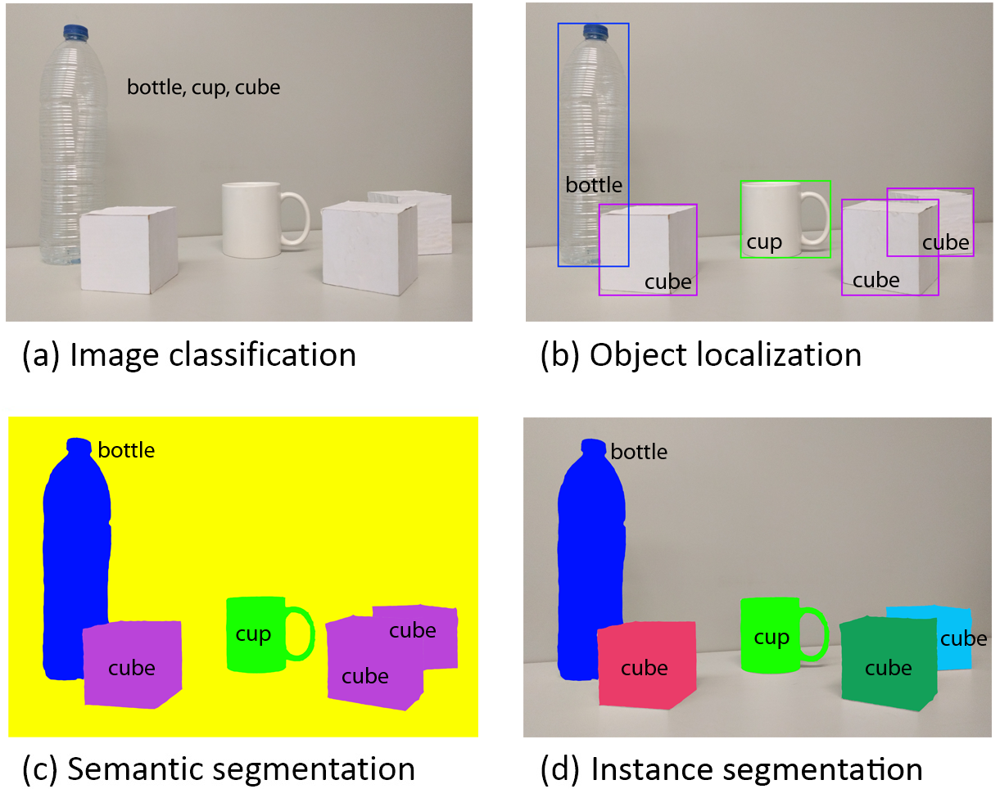
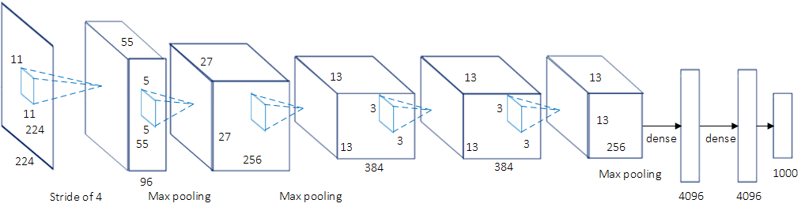
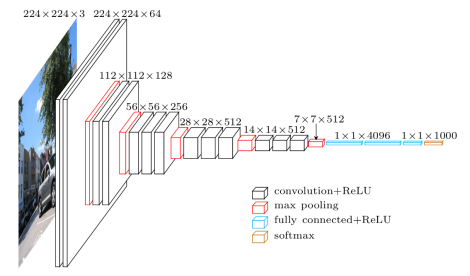
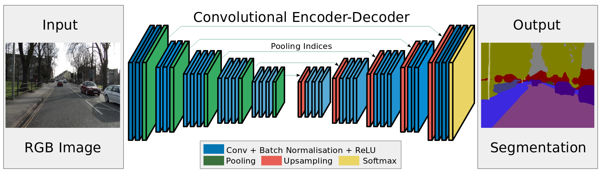

### A Review on Deep Learning Techniques Applied to Semantic Segmentation

#### 引论
- 深度学习解决语义分割问题这一方式可以应用的领域包括自动驾驶、人机交互、计算摄影学、图像搜索引擎、增强现实等。
- 该过程通常会用到卷积神经网络（CNN).

#### 术语和背景概念

- 深度学习解决语义分割的起源可以追溯到分类任务，即给定一个整体的输入数据，深度学习方法给出一个预测数据。例如从给定的图像中识别出物体，甚至当有多个物体时给出一个排名列表数据。
- 更深一步的话，深度学习方法可以完成物体定位或检测的工作，即同时给出物体的类别和其在图像中的位置信息。
- 语义分割即是物体定位的更进一步的工作,语义分割以像素点为单位给出输入图像的预测值.更进一步地,可以将语义分割的结果上升到实例分割(相同类别的不同个体拥有不同的标注),或是基于组成部分的分割(将实例分割的结果进一步按组件不同进行分割).下图便展示了这一图像处理的发展过程.

 
- 语义分割能够以公式描述为:给定一个标签集合 $L=\{l_1, l_2, ..., l_k\}$ 和一个由一系列随机变量组成的集合 $X=\{x_1, x_2, ..., x_N\}$ ,其中每一个标签代表一个类别的目标,例如飞机,路牌,背景等. $X$ 几个代表一个2D的图像, $x_i$ 代表其中一个像素,语义分割的目标便是找出集合 $X$ 到集合 $L$ 的一个对应规则.

#### 常见的深度网络结构

1. AlexNet [Wikipedia](https://en.wikipedia.org/wiki/AlexNet)

- 最初由 Alex Krizhevsky 等人提出 [(文章链接)](https://papers.nips.cc/paper/4824-imagenet-classification-with-deep-convolutional-neural-networks.pdf). 其包含五个卷积层, 最大池化, 并使用了非线性激活函数 ReLU, 三个完全连接的层和一个 DROPOUT. 下图是一个简化后的 AlexNet 结构.

1. VGG

- 全称 Visual Geometry Group, 由牛津大学的视觉几何组(VGG) 提出.该模型包含16个权重层,故也成为 VGG-16.与之前不同的是, VGG-16 使用了多个有较小感受野(receptive field)[(介绍)](https://zhuanlan.zhihu.com/p/28492837)的卷积层.这样使得参数减少,同时函数的非线性特征增强,使得识别力提升,同事训练难度降低.

3. GoogLeNet

- 由Szegedy等人提出 [(文章链接)](https://arxiv.org/abs/1409.4842). 特点是较为复杂,包含22层和一个起始模块. 该方法证明了 CNN 层能够以顺序方法以外的方式进行组织. 这些模块包括Network in Network（NiN）层、池化操作、大尺寸和小尺寸的卷积层，这些层平行计算，之后通过一个1x1的卷积操作进行降维。GoogLeNet通过减少了参数个数和操作次数降低内存使用和计算量.

4. ResNet

- 由微软提出 [(文章链接)](https://arxiv.org/abs/1512.03385). 其引入了残留块(residual block)的概念,并且具有152层的深度.残留块通过引入身份跳过连接(identity skip connections)来解决训练深度较大的体系结构的问题，以便各层可以将其输入复制到下一层。基本思想是保证下一层能够学到不同于上一次输入的新信息.这种链接能够帮助克服梯度消失的问题.

5. ReNet

- 为将递归神经网络(RNN)应用到高维任务,  Graves 等人提出多维递归神经网络(MDRNN)的概念  [(文章链接)](https://arxiv.org/abs/0705.2011) . Visin等人又基于此提出 ReNet 结构 [(链接)](https://arxiv.org/abs/1505.00393). 该结构使用了一般地顺序 RNN. 即 RNN 的数量随着输入图像的维数线性增长. 在该方法中,每个卷积层(卷积+池化) 都替换为四个 RNN 结构,他们分别沿着两个方向垂直和水平地扫描输入图像.

##### 迁移学习

- 通过继续训练来微调预先训练好的网络的权重是一种常见的迁移学习的方案。因为从头开始自行训练网络会遇到耗时长或是训练集不足,或是权重标记不适宜的问题.

- 由于逐像素标注和分割的操作困难的问题,该类数据库通常没有分类数据集.

##### 数据预处理和数据扩张
- 数据扩张对于训练常规和深结构的模型都有益处，可以加快收敛或是避免过拟合。

- 数据扩张通常包括对数据或特征空间的一系列变换，或是同时对二者进行操作。常用的扩张方式有平移，旋转，变形，缩放，颜色空间移位，裁切等。

#### 常用的数据集

##### 2D 图像数据集

- PASCAL Visual Object Classes (VOC) [(链接)](http://host.robots.ox.ac.uk/pascal/VOC/voc2012/)

- PASCAL Context [(链接)](https://cs.stanford.edu/~roozbeh/pascal-context/)
- Semantic Boundaries Dataset (SBD) [(链接)](. http://home.bharathh.info/home/sbd)
- Microsoft Common Objects in Context (COCO) [(链接)](http://cocodataset.org/)
- SYNTHetic Collection of Imagery and Annotations (SYNTHIA) [(链接)](http://synthia-dataset.net/)
- Cityscapes [(链接)](https://www.cityscapes-dataset.com/)
- CamVid [(链接)](http://mi.eng.cam.ac.uk/research/projects/VideoRec/CamVid/)
- KITTI (自动驾驶常用数据集)
- Youtube-Objects
- Adobe’s Portrait Segmentation
- Materials in Context (MINC)
- Densely-Annotated VIdeo Segmentation (DAVIS)
- Stanford background
- SiftFlow

##### 2.5D 数据集
即包括 RGB 和深度数据的数据集.

- NYUDv2 [(链接)](http://cs.nyu.edu/~silberman/projects/indoor_scene_seg_sup.html)
- SUN3D [(链接)](http://sun3d.cs.princeton.edu/)
- SUNRGBD [(链接)](http://rgbd.cs.princeton.edu/)
- The Object Segmentation Database (OSD) [(链接)](http://www.acin.tuwien.ac.at/?id=289)
- RGB-D Object Dataset [(链接)](http://rgbd-dataset.cs.washington.edu/)

##### 3D 数据集

- ShapeNet Part
- Stanford 2D-3D-S
- A Benchmark for 3D Mesh Segmentation
- Sydney Urban Objects Dataset
- Large-Scale Point Cloud Classification Benchmark

#### 研究方法

- 现如今最成功且最先进的用于语义分割的深度学习方法都来自完全卷积网络(FCN). 该工作展示了如何将 CNN 进行端到端的训练,使其学习如何有效的根据任意大小的输入进行语义分割的密集预测.

- FCN的局限：
没有考虑全局信息
没有默认的实例敏感度
效率远远达不到实时
不能够直接适应不定型数据，如3D点云或模型

##### 解码器变体

- 该类变体包含一个编码器(encoder),用于从输入图像中产生出低分辨率表示,或者是特征图,该部分通常基于 FCN.之后还包括一个解码器(decoder)用于将编码器生成的低分辨率表示或是特征图生成按逐像素的分割预测图.在这类结构中解码器的部分通常互不相同. 一个解码器的例子是 SegNet, 其结构如下图所示.

##### 整合上下文信息

- 语义分割任务需要整合多空间尺度下的信息，也意味着整合局部和全局信息。整合局部以获得较好的像素级准确性,同事整合全局信息以解决局部模糊的问题. 为让 CNN 感知到全局信息有多种方式, 例如使用条件随机场(CRF)作为处理后的优化步骤,扩张卷积(dilated convolution),多尺度聚合,或是将全局建模交给另一个深度网络完成,例如 RNN.

#### 实例分割

- 实例分割(instance segmentation)可以看作是语义分割的下一步,其主要目标是将分类为同一类的物体分割成不同的实例.

- 为提升现有成果的效率, Hariharan 等人提出了同时检测和分割的方法(SDS), 该方法应用自下而上的分层图像分割方法和候选目标生成过程(Multi-scale COmbinatorial Grouping, MCG) 以获得求方案,之后对每一个区域使用区域CNN(R-CNN)的一个改版提取特征.随后用MCG方法提供的边界框(bounding box)进行微调，之后，通过一个线性支持向量机（Support Vector Machine, SVM）在CNN特征的基础上实现区域提案的分类。最后，应用非极大值抑制（Non-Maximum Suppression，NMS）对之前的提案进行优化。

- 之后，Pinheiro等人提出了DeepMask模型，一种基于单个ConvNet的对象提议方法。 该模型预测输入补丁的分割掩码以及该补丁包含对象的可能性。 这两个任务是通过单个网络联合学习和计算的，共享除任务特定的最后一层以外的大多数层。

#### 评估

##### 评估标准
- 可以作为语义分割算法性能评估标准的几个指标为: 执行时间, 内存占用, 准确度. 根据系统的要求不同,各评估标准的重要程度也有所不同。

- 执行时间这一指标在相当多的系统中都很重要，算法的执行时间也必须满足系统的时间要求。但训练模型的时间通常重要程度较低，因为训练模型的过程是一个离线过程，且执行时间也受运行环境的影响。但是，为了方便后面的研究者再现成果，或者帮助人们判断算法是否有用，通常会给出在具体执行条件下的时间以供参考。

- 虽然扩展内存易于操作的特性使得内存使用这一指标相较于运行时间重要性降低，但对于机器人平台或是嵌入式系统等内存有限的情况下，该指标也必须进行评估。另外，即使是在服务器上，GPU的内存也不是无限的。因此，考察算法的内存消耗也是必要的。

- 对于准确率度量，本文给出了几种用于像素级语义分割的度量指标。为表述方便，指定几个符号的表示： 假设共有 $k+1$ 个分类（$L_0$ 到 $L_k$, 包括空类或是背景)， $p_{ij}$表示类别 $i$ 下的像素点被判断成类别 $j$ 的像素点的个数。换句话说，$p_{ii}$ 表示true positives，$p_{ij}$ 和 $p_{ji}$ 分别表示false positives和false negative。

- 像素级准确度（Pixel Accuracy，PA）

$$PA = \frac{\sum_{i=0}^{k} p_{ij}}{ \sum_{i=0}^{k} \sum_{j=0}^{k} p_{ij}} $$

- 平均像素准确度（Mean Pixel Accuracy ， MPA）

$$ MPA = \frac{1}{k+1} \sum_{i=0}^{k} \frac{p_{ii}}{\sum_{j=0}^{k}p_{ij}} $$

- 并集的平均交集（Mean Intersection over Union， MIoU）
 最常用。
$$ MIoU = \frac{1}{k+1} \sum_{i=0}^{k} \frac{p_{ii}}{\sum_{j=0}^{k} p_{ij} + \sum_{j=0}^{k} p_{ji} - p_{ii}} $$

- 频率加权的 MIoU （Frequency Weighted Intersection over Union ，FWIoU)

$$ FWIoU = \frac{1}{\sum_{i=0}^{k}\sum_{j=0}^{k}p_{ij}} \sum_{i=0}^{k} \frac{\sum_{j=0}^{k}p_{ij}p_{ii}}{\sum_{j=0}^{k}p_{ij} + \sum_{j=0}^{k}p_{ji} - p_{ii}} $$

#### 未来的可能研究方向

- 处理3D数据集
- 顺序数据集
- 使用图像卷积网络（GCN）分割点云数据
- 上下文信息整合
- 实时语义分割
- 在限制内存的环境下进行分割操作
- 序列的时间一致性
- 多视图整合
