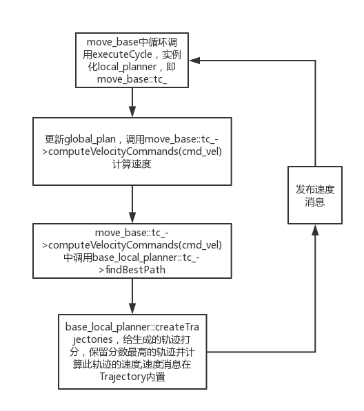

- 取样 -> 模拟 -> 评估 -> 选择 -> 重置并重复

- 输入： `Costmap2D` & `tf`.

- `cost` 计算方法
```
cost = 
  pdist_scale * (distance to path from the endpoint of the trajectory in map cells or meters depending on the meter_scoring parameter) [map cell 里的轨迹端点到路径（path）的距离（或者是根据`meter_scoring`参数得到的米数数据]
  + gdist_scale * (distance to local goal from the endpoint of the trajectory in map cells or meters depending on the meter_scoring parameter) map cell 里的轨迹端点到局部终点（local goal）的距离（或者是根据`meter_scoring`参数得到的米数数据
  + occdist_scale * (maximum obstacle cost along the trajectory in obstacle cost (0-254)) 轨迹上的障碍物代价中的最大值 （0-254）
```

#### 流程图 来自[这里](https://blog.csdn.net/zhxue_11/article/details/84101931)

