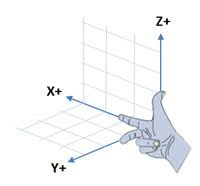
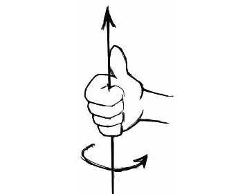

# ROS 入门实例

#### ROS结构回顾
- ROS 中的核心实体叫做节点，节点通常是一个用 Python 或 C++ 编写的小型程序，用于执行特定的任务，例如管理摄像头或者是进行路径规划等。节点之间彼此独立地启动或停止。
- 节点之间通过传递消息来进行通信。通信方式采用订阅-发布机制。节点可以在某个话题上发布消息，或是向其他节点提供服务。当节点在某个话题下发布消息时，订阅该话题的节点便可收到该消息。
- 一个节点可以定义一个或多个服务，ROS 服务会在接收到其他节点的请求是产生某种动作或是发送回复。高级的 ROS 节点还可以订阅多个话题和服务，将多个收到的数据进行结合，还可以发布消息或是提供自己的服务。
- ROS 是一个以网络为中心的框架，即整个 ROS 应用系统的的各个节点可以分布在网络互联的多个设备上。例如摄像机节点运行在机器人本地的计算机上，此时 RViz 等节点可以运行在互联网上的其他设备上。采用此方法可以讲负载分布在多台计算机上。


#### 如何寻找第三方 ROS 数据包
- 寻找 ROS Wiki
在 [ROS Wiki](wiki.ros.org) 中进行搜索
- 使用 `roslocate` 命令
适用于包名已知的情况。例如寻找名为 `amcl` 的包，可以运行如下命令：
``` shell
$ roslocate uri amcl
```
返回如下的结果：
``` shell
Using ROS_DISTRO: kinetic
https://github.com/ros-planning/navigation.git
```
之后使用 `git clone` 命令便可以将该包的源代码克隆至自建的 catkin 工作空间中。


#### 控制移动底座
##### 单位长度和坐标系
- ROS 使用右手定则来规定坐标轴之间的关系。
- 如图，食指指向的方向即为 x 轴正方向，相应地，中指指向 y 轴正方向，拇指指向 z 轴正方向。

- 对于使用 ROS 的机器人，x 轴代表向前，y 轴代表向左，z 轴代表向上的方向。

- 对于旋转，其正方向也由右手定则规定。
- 如图，右手拇指指向任意轴的正方向时，其余四指弯曲的方向即为旋转的正方向。


- ROS 使用公制单位，即线速度通常记为米每秒（m/s)，角速度通常记为弧度每秒（rad/s)。

##### 动作控制的层次
- 控制机器人这一动作可在不同层次完成，在大多数控制层次中 ROS 都提供了对应的控制方法。这些层次代表了不同层次的抽象。
###### 电机，轮子和编码器
- 大部分运行 ROS 的差速驱动机器人在电机或轮子上使用[编码器](https://zh.wikipedia.org/wiki/%E6%97%8B%E8%BD%89%E7%B7%A8%E7%A2%BC%E5%99%A8)（encoder）。编码器可以将旋转位置或旋转量转换成模拟或数字信号,在轮子旋转过程中，每当轮子特定的转动角度时便发送脉冲。这样，在轮直径和轮间距已知的情况下便可以通过计算将编码器脉冲转换成运动过程中移动的距离或是转过的角度。
- ROS 内部将运动数据聚合并命名为里程（odometry)。里程数据的来源包括但不限于编码器的数据。运行过程中可以结合其他传感器（IMU， GPS等）的数据修正机器人的里程数据，减小误差。

###### ROS 基控制器
- 在该抽象层次中，机器人的目标速度使用现实速度单位表示,例如米每秒或是弧度每秒。
- [PID 控制](https://zh.wikipedia.org/wiki/PID%E6%8E%A7%E5%88%B6%E5%99%A8): PID 控制，即比例-积分-微分控制。该算法使用当前速度和目标速度的误差，结合对时间的积分和微分来纠正当前的速度值。
- 驱动和 PID 控制器在 ROS 中由一个名为 base controller 的节点控制，该节点运行在连接到电机的计算机上。
- 一般地，该基控制器监听 `/cmd_vel` 话题下的动作指令，同时在 `/odom` 话题下发布里程数据。
- 同时，该节点一般也会发布从 `/odom` 到 `/base_link` 或是 `/base_footprint` 的 `tf` 数据。
- 也有一些机器人使用 `robot_pose_ekf` 包，结合里程信息和陀螺仪数据得到机器人位姿和朝向的更加准确的数据。 此时， `robot_pose_ekf` 节点负责发布从 `/odom` 到 `/base_foorprint` 的 `tf` 数据。

###### 使用 `move_base` 包实现基于参考系的动作控制
- `move_base` 包允许用户指定运动的目标位置和朝向，该位置和朝向通常是基于某个参考系。
- 之后 `move_base` 将控制机器人向目标点移动，同时躲避障碍物。
- `move_base` 在选择路径的过程中结合了里程信息和全局及局部代价地图进行路径规划工作。该节点依照配置中设置的上下限对机器人的线速度和角速度进行控制。

###### 使用 gmapping 和 amcl 的 SLAM
- 在更高的层次上， ROS 允许机器人使用 SLAM 中的 `gmapping` 包构建周围环境的地图，该建图过程可以使用摄像头或是激光雷达等传感器。
- 环境地图建立后， ROS 提供 名为 `amcl` 的包，使用[自适应蒙特卡洛定位法](https://en.wikipedia.org/wiki/Monte_Carlo_localization) 实现基于当前传感器数据和里程数据的自动定位功能。

###### 语义目标
- 在最高层次上，可以使用自然语言的语义信息来指定终点。例如”去厨房拿一瓶啤酒“或是简单地”拿一瓶啤酒“。
- 在这种情况下，该语义上的终点将会被解析为一系列的动作。这些动作中包括要求机器人移动到特定位置的请求。系统将目标位置数据传递至定位与路径规划层，指挥机器人进行移动。
- 该功能可能用到的包： `smach` `behavior trees` `knowrob`。

###### ROS 中 `twist` 消息和轮子转动
- ROS 使用 `geometry_msgs/Twist` 消息类型向基控制器发送消息指令。该消息一般发布在 `/cmd_vel` 话题下，包含机器人运动的线速度和角速度的信息。该消息的格式如下所示：
```
geometry_msgs/Vector3 linear
  float64 x
  float64 y
  float64 z
geometry_msgs/Vector3 angular
  float64 x
  float64 y
  float64 z
``` 

- 然而，对于在二维平面运动的机器人，系统向其发布 `twist` 消息时，只需要用到线速度的 `x` 和角速度的 `z` 两个数据项，其余数据项恒为 0。
- 因为该类机器人只能前进或后退，旋转时也只能绕垂直于运动平面的坐标轴（即 z 轴）进行旋转。

###### 话题 `/odom` 和框架 `/odom` 的对比
- 示例中使用了 `TransformListener` 去访问测量信息，并未通过订阅 `/odom` 话题获取测量信息。因为发布在 `/odom` 话题的数据并不完全。
- 例如，Turtlebot 使用了单轴陀螺仪额外估算机器人的旋转数据，在 `robot_pose_ekf` 节点该数据与轮子编码器的数据进行合并，从而实现对旋转更精确的估算过程。
- `robot_pose_ekf` 并不会将估算结果重新发布至 `/odom`  话题下,而是发布至 `/odom_combined` 话题下。并且发布时的消息格式更改为 `geometry_msgs/PoseWithCovarianceStamped`， 并非原先的 `nav_msgs/Odometry`。
- 总体来说，使用 `tf` 监听 `/odom` 和 `/base_link`（或是`/base_footprint`) 之间的转换比单纯依赖 `/odom` 话题的消息更为安全。

